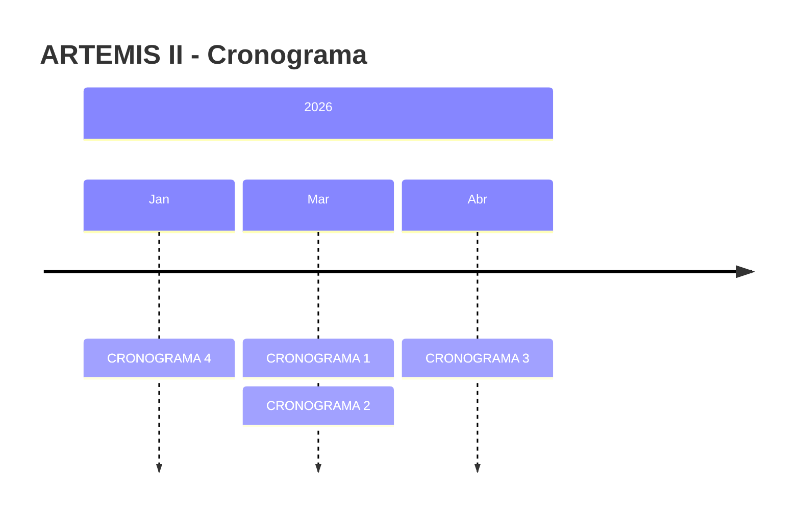
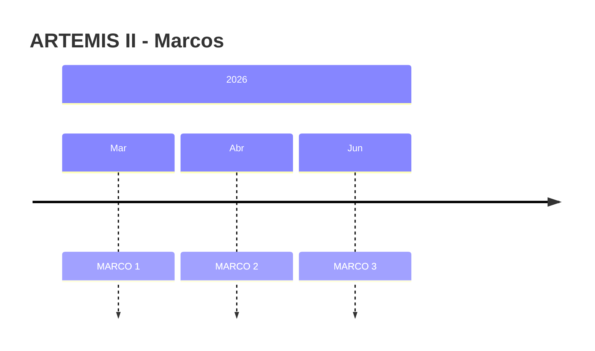

# ARTEMIS II

**ARTEMIS II**

---

## Informações Gerais

| Campo | Valor |
|------|------|
| Status | Em execução |
| Responsáveis | Responsáveis |
| Repositório |  Responsáveis Repositório |

## Descrição

Descrição

## Classificação

| Natureza | Impacto | Complexidade | Visibilidade |
|----------|---------|--------------|---------------|
| Produto | Intersetorial | Média | Estratégico |

## Prazos

- Início: Início
- Fim:  Início Previsão de término

## Diretrizes

Diretrizes

## Objetivo

Objetivo

## Ganhos Esperados

GANHOS ESPERADOS

## Produtos

| Produto | Previsão | Status |
|--------|----------|--------|
| PRODUTO 1  | PREVISÃO 1 | Não iniciado |
| PRODUTO 2  | PREVISÃO 2  | Concluído |

## Ações

| Ação | Responsável | Prazo |
|------|-------------|-------|
| AÇÃO 1 | RESPONSÁVEL 1  | PRAZO 1  |
| AÇÃO 2  | RESPONSÁVEL 2  | PRAZO 2  |

## Cronograma

```mermaid
gantt
    title ARTEMIS II - Cronograma
    dateFormat YYYY-MM-DD

    section Concluído
    CRONOGRAMA 2 (RESPONSÁVEL 2 ) :, done, 2026-04-01, 13d
    CRONOGRAMA 4 (RESPONSÁVEL 5) :, done, 2026-02-01, 39d

    section Em andamento
    CRONOGRAMA 1 (RESPONSÁVEL 1 ) :, active, 2026-04-01, 12d
    CRONOGRAMA 3 (RESPONSÁVEL 3) :, active, 2026-04-29, 55d

```



## Indicadores

| Indicador | Base | Meta | Frequência |
|---|---|---|---|
| INDICADOR 1 | LINHA INDICADOR 1 | META INDICADOR 1 | Semanal |
| INDICADOR 2  | LINHA INDICADOR 2  | META INDICADOR 2  | Mensal |

## Status RAG

- **Prazo:** 🟢 Verde
  - Prazo
- **Qualidade:** 🟢 Verde
  - ualidade
- **Dependências:** 🟠 Âmbar
  -  Dependências
- **Equipe:** 🔴 Vermelho
  - Equipe

## Riscos

| Risco | Probabilidade | Impacto | Mitigação |
|------|---------------|---------|------------|
| RISCO 1  | Média | Médio | MITIGAÇÃO 1  |
| RISCO 2 | Alta | Alto | MITIGAÇÃO 2 |

## Linha do Tempo



## GitHub

### Issues

- [#3 teste](https://github.com/mathpitanguy/pitanguy/issues/3)
- [#4 novo teste](https://github.com/mathpitanguy/pitanguy/issues/4)
- [#5 testando automatização](https://github.com/mathpitanguy/pitanguy/issues/5)
- [#6 a](https://github.com/mathpitanguy/pitanguy/issues/6)
- [#7 b](https://github.com/mathpitanguy/pitanguy/issues/7)

## Observações

OBSERVAÇOES

---
Gerado em 13/04/2026