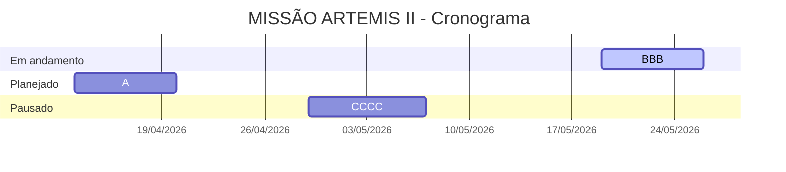
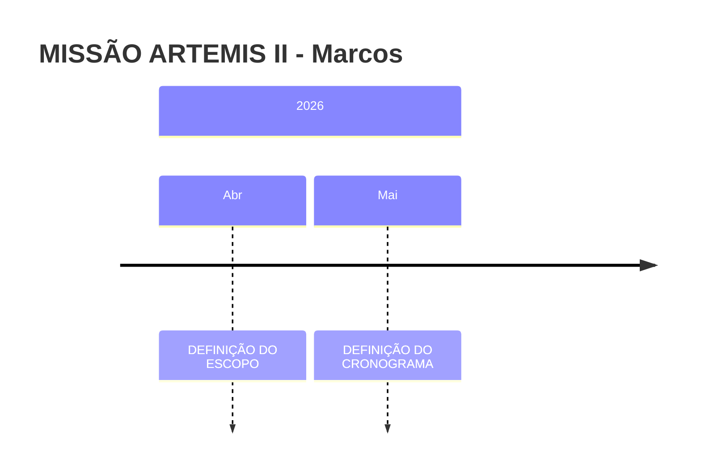

# MISSÃO ARTEMIS II

**SPLOR - AID**

---

## Informações Gerais

| Campo | Valor |
|------|------|
| Status | Em execução |
| Responsáveis | RESPONSÁVEIS |
| Repositório | REPOSITÓRIO |

## Descrição

DESCRIÇÃO

## Classificação

| Natureza | Impacto | Complexidade | Visibilidade |
|----------|---------|--------------|---------------|
| Infra | Interno | Média | Operacional |

## Prazos

- Início: INÍCIO
- Fim: TÉRMINO

## Diretrizes

DIRETRIZES

## Objetivo

OBJETIVO

## Ganhos Esperados

GANHOS ESPERADOS

## Produtos

| Produto | Previsão | Status |
|--------|----------|--------|
| PRODUTO 1 | A DEFINIR | Em andamento |

## Ações

| Ação | Responsável | Prazo |
|------|-------------|-------|
| AÇÃO 1 | RESPONSÁVEL 1 | A DEFINIR |

## Cronograma

## Indicadores

| Indicador | Base | Meta | Frequência |
|---|---|---|---|
| INDICADOR 1 | 1 | 1 | Semanal |

## Status RAG

- **Prazo:** 🟢 Verde
  - PRAZO
- **Qualidade:** 🔴 Vermelho
  - QUALIDADE
- **Dependências:** 🟠 Âmbar
  - DEPENDÊNCIAS
- **Equipe:** 🟢 Verde
  - EQUIPE

## Riscos

| Risco | Probabilidade | Impacto | Mitigação |
|------|---------------|---------|------------|
| A | Média | Baixo | TESTE |

## Linha do Tempo

## GitHub

### Issues

- [#3 teste](https://github.com/mathpitanguy/pitanguy/issues/3)
- [#4 novo teste](https://github.com/mathpitanguy/pitanguy/issues/4)
- [#5 testando automatização](https://github.com/mathpitanguy/pitanguy/issues/5)
- [#6 a](https://github.com/mathpitanguy/pitanguy/issues/6)
- [#7 b](https://github.com/mathpitanguy/pitanguy/issues/7)

## Observações

OBSERVAÇÕES

---
Gerado em 13/04/2026