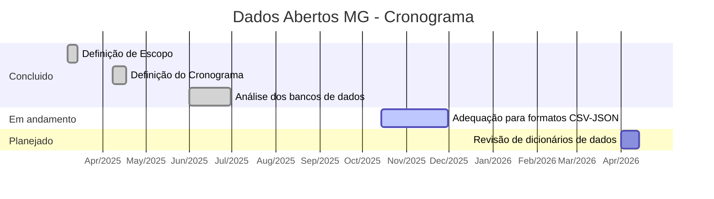
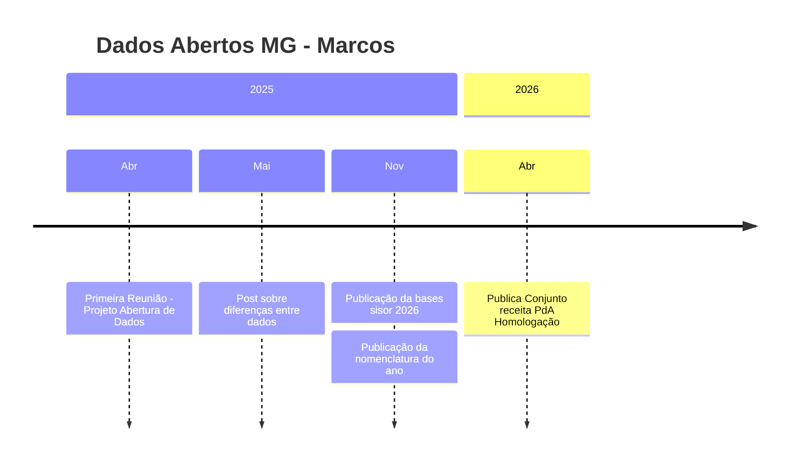

# Dados Abertos MG

**AID/SPLOR - SEPLAG**

---

## Informações Gerais

| Campo | Valor |
|------|------|
| Status | Em execução |
| Responsáveis | Equipe |
| Repositório |  |

## Descrição

Estruturação, padronização e disponibilização de informações sobre planejamento e orçamento do Estado de Minas Gerais em formato aberto e acessível, em conformidade com a Lei de Acesso à Informação.

## Classificação

| Natureza | Impacto | Complexidade | Visibilidade |
|----------|---------|--------------|---------------|
| Dados | Cidadão | Alta | Estratégico |

## Prazos

- Início: 02/03/2025
- Fim: A definir 

## Diretrizes

- Compromisso institucional: O projeto conta com o apoio e alinhamento estratégico das lideranças da Secretaria de Planejamento e Gestão, garantindo sua priorização na agenda governamental.

- Conformidade normativa: Segue rigorosamente as diretrizes da Lei de Acesso à Informação e os padrões estabelecidos pelo governo federal para dados abertos, assegurando a anonimização de dados sensíveis quando necessário.

- Acesso aos sistemas de origem dos dados: Estabelece cooperação com as áreas gestoras dos sistemas orçamentários para garantir a extração e padronização das informações.

- Uso de tecnologias abertas: Todas as ferramentas utilizadas no projeto são open source, garantindo transparência e acesso irrestrito aos dados.

- Cronograma realista: As atividades são planejadas de forma estratégica, considerando desafios técnicos e operacionais para assegurar a implementação eficiente do projeto.

## Objetivo

Ampliar a transparência, fomentar a participação cidadã e fornecer base confiável para análise e tomada de decisão.

## Ganhos Esperados

- Redução drástica no tempo de atualização dos dados de semanas para menos de 24 horas.
- Queda de 40% nas demandas via LAI, permitindo que o cidadão acesse a informação diretamente.
- Estruturação de 100% das bases com metadados, garantindo interoperabilidade e qualidade técnica.
- Ampliação do controle social através da oferta de dados brutos para auditoria e fiscalização.
- Otimização da gestão pública pelo uso de bases automatizadas, eliminando retrabalho e inconsistências.
- Fomento ao ecossistema de soluções tecnológicas baseadas em dados abertos do Estado de Minas Gerais.

## Produtos

| Produto | Previsão | Status |
|--------|----------|--------|
| Base de Dados da Receita | A definir | Em andamento |
| Base de Dados da Despesa | A definir | Em andamento |
| Base de Dados do PPAG | A definir | Em andamento |
| Base de Dados da LOA | A definir | Em andamento |
| Dicionários de Dados Padronizados  | A definir | Em andamento |

## Ações

| Ação | Responsável | Prazo |
|------|-------------|-------|
| Levantamento de dados orçamentários | A definir | A definir |
| Adequação para formatos CSV/JSON | A definir | A definir |
| Revisão de dicionários de dados  | A definir | A definir |
| Implementação de rotinas de atualização diária automatizada | A definir | A definir |

## Cronograma

## Indicadores

| Indicador | Base | Meta | Frequência |
|---|---|---|---|
| Tempo de Atualização (Pipeline) | 10–15 dias úteis | < 24 horas | Mensal |
| Nível de Padronização (Metadados) | 0% ( bases sem dicionário estruturado) | 100% de bases com datapackage.json | Anual |
| Taxa de Desoneração (Redução LAI) | 100% das demandas via LAI | -40% em solicitações diretas sobre dados orçamentários | Anual |

## Status RAG

- **Prazo:** 🔴 Vermelho
  - Observação sobre prazo
- **Qualidade:** 🟢 Verde
  - Observação sobre Qualidade
- **Dependências:** 🟠 Âmbar
  - Observação sobre Qualidade
- **Equipe:** 🟢 Verde
  - Observação sobre Equipe

## Riscos

| Risco | Probabilidade | Impacto | Mitigação |
|------|---------------|---------|------------|
| Bloqueio em Sistemas Origem | Alta | Médio | Estabelecer protocolos de contingência.  |
| Falha na Automação | Média | Alto | Implementação de alertas automáticos em caso de erro na execução dos scripts. |
| Inconsistência de Dados | Alta | Baixo | Auditoria automática de antes da publicação (ex: soma da despesa vs. total). |

## Linha do Tempo

## GitHub

### Issues

| # | Título | Estado | Aberto em | Fechado em |
|---|--------|--------|-----------|------------|
| [#3](https://github.com/mathpitanguy/pitanguy/issues/3) | teste | Aberta | 09/04/2026 | — |
| [#4](https://github.com/mathpitanguy/pitanguy/issues/4) | novo teste | Aberta | 09/04/2026 | — |
| [#5](https://github.com/mathpitanguy/pitanguy/issues/5) | testando automatização | Aberta | 09/04/2026 | — |
| [#6](https://github.com/mathpitanguy/pitanguy/issues/6) | a | Aberta | 09/04/2026 | — |
| [#7](https://github.com/mathpitanguy/pitanguy/issues/7) | b | Fechada | 09/04/2026 | 09/04/2026 |

## Observações

A evolução do Projeto de Abertura de Dados Orçamentários de Minas Gerais será documentada e atualizada no portal da Assessoria de Inteligência de Dados (AID). A cada etapa concluída, novos conjuntos de dados serão publicados, ampliando o acesso às informações públicas e fortalecendo a transparência governamental.

Por meio deste projeto, Minas Gerais avança na construção de um ecossistema de dados abertos robusto, beneficiando a sociedade e promovendo uma gestão pública mais eficiente e acessível a todos.

---
Gerado em 14/04/2026