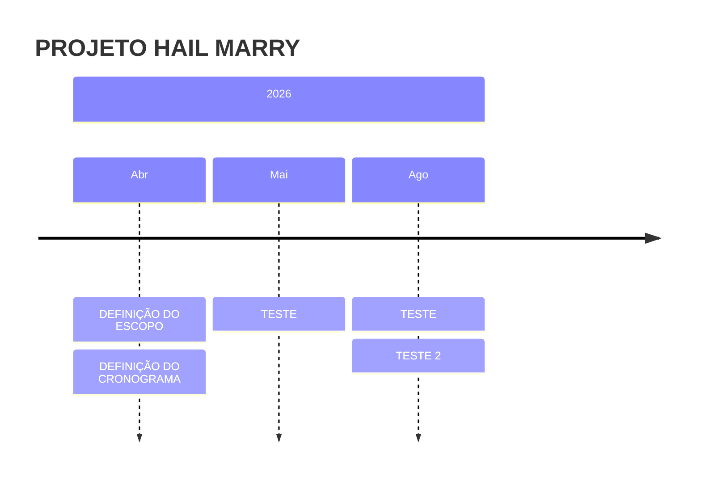

# PROJETO HAIL MARRY

---

## Informações Gerais

| Campo | Valor |
|-------|-------|
| **Status** | Em execução |
| **Responsáveis** | — |
| **Repositório** | [MATHEUS](MATHEUS) |
| **Descrição** | ASDSDASA |

## Classificação

| Natureza | Impacto | Complexidade | Visibilidade |
|----------|---------|--------------|---------------|
| Infra | Interno | Baixa | Estratégico |

## Prazos

- **Início:** ASD
- **Previsão de término:** ASD

## Diretrizes

Infra

## Objetivo

Interno

## Ganhos Esperados

Baixa

## Produtos / Entregas

| # | Produto | Previsão | Status |
|----|---------|----------|--------|
| 1 | TESTE 1 | TESTE 2 | Não iniciado |
| 2 | TESTE 2 | TESTE  | Não iniciado |

## Ações

| # | Ação | Responsável | Prazo |
|----|------|-------------|-------|
| 1 | TESTE  | TESTE  | TESTE  |
| 2 | TESTE  | TESTE  | TESTE  |

## Cronograma

### Detalhamento das fases

| # | Fase / Etapa | Responsável | Início | Fim | Status |
|----|-------------|-------------|--------|-----|--------|
| 1 | TESTE | TESTE | 29/03/2026 | 30/03/2026 | Em andamento |
| 2 | TESTE | TESTE | 07/04/2026 | 20/05/2026 | Em andamento |
| 3 | TESTE | TESTE | 22/06/2026 | 12/08/2026 | Em andamento |

### Visualização do Cronograma (Gantt)

```mermaid
gantt
    title PROJETO HAIL MARRY - Cronograma
    dateFormat YYYY-MM-DD
    axisFormat %b/%Y
    tickInterval 1month
    
    section 🔄 Em andamento
    TESTE : , active, 2026-03-30, 2d
    TESTE : , active, 2026-04-08, 44d
    TESTE : , active, 2026-06-23, 52d
    
```

> **Legenda:** ✅ Concluído | 🔄 Em andamento | 📋 Planejado | ⚠️ Atrasado | ⏸️ Pausado

## Indicadores

| Indicador | Linha base | Meta | Frequência |
|-----------|------------|------|-------------|
| TESTE  | TESTE  | TESTE  | Trimestral |
| TESTE  | TESTE  | TESTE  | Semanal |

## Status RAG

- **Prazo:** 🟢 Verde
  - Observação: TESTE 
- **Qualidade:** 🟢 Verde
  - Observação: TESTE 
- **Dependências:** 🟢 Verde
  - Observação: TESTE 
- **Equipe:** 🟢 Verde
  - Observação: TESTE 

## Riscos

| # | Risco | Probabilidade | Impacto | Mitigação |
|----|-------|---------------|---------|------------|
| 1 | TESTE  | Baixa | Baixo | TESTE  |
| 2 | TESTE  | Baixa | Médio | TESTE  |
| 3 | TESTE  | Média | Baixo | TESTE  |

## Atas de Reunião

- **2026-04-07** — [DEFINIÇÃO DE ESCOPO](https://splor-mg.github.io/handbook/linha_do_tempo/projeto_dados_abertos_mg/)
- **Data não definida** — [DEFINIÇÃO DE CRONOGRAMA](https://splor-mg.github.io/handbook/linha_do_tempo/projeto_dados_abertos_mg/)
- **Data não definida** — [Ata](https://splor-mg.github.io/handbook/linha_do_tempo/projeto_dados_abertos_mg/)

## Marcos do Projeto

- **14/04/2026** — DEFINIÇÃO DO ESCOPO *(marco)*
- **15/04/2026** — DEFINIÇÃO DO CRONOGRAMA *(marco)*
- **27/05/2026** — TESTE *(marco)*
- **17/08/2026** — TESTE *(marco)*
- **10/08/2026** — TESTE 2 *(marco)*

### Timeline de Marcos



## Contribuições GitHub

### Issues

| # | Título | Status | Data criação | Link |
|---|--------|--------|--------------|------|
| #3 | teste | Aberta | 09/04/2026 | [Abrir](https://github.com/mathpitanguy/pitanguy/issues/3) |
| #4 | novo teste | Aberta | 09/04/2026 | [Abrir](https://github.com/mathpitanguy/pitanguy/issues/4) |
| #5 | testando automatização | Aberta | 09/04/2026 | [Abrir](https://github.com/mathpitanguy/pitanguy/issues/5) |
| #6 | a | Aberta | 09/04/2026 | [Abrir](https://github.com/mathpitanguy/pitanguy/issues/6) |
| #7 | b | Fechada | 09/04/2026 | [Abrir](https://github.com/mathpitanguy/pitanguy/issues/7) |

## Observações

Estratégico

---

*Gerado automaticamente em 13/04/2026*
